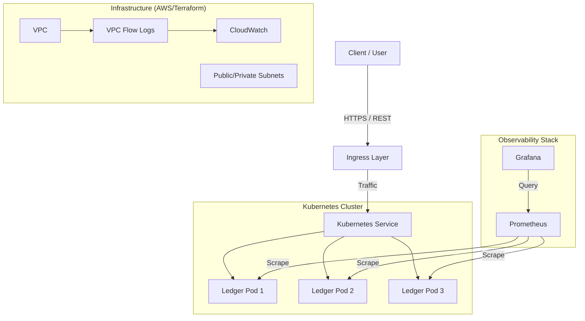

# Architecture & Design: Secure Ledger Service

## 1. System Overview
The Secure Ledger Service is a high-performance, secure-by-default transaction recording system designed to demonstrate **Zero Trust principles** and **Cloud-Native resilience**.

## 2. Core Principles

### Zero Trust Architecture
- **Assumption**: The network is always hostile.
- **Implementation**:
    - **Identity-Based Logic**: We don't trust IP addresses; we validate payloads.
    - **Least Privilege**: The application container runs as a non-root user (UID 1000) with *all* Linux capabilities dropped.
    - **Immutable Infrastructure**: The root filesystem is Read-Only. An attacker cannot persist malware.

### Observability First
- **Metrics**: Native Prometheus instrumentation (`/metrics`) tracks every request's latency and status code.
- **Traceability**: Structured JSON logging (`slog`) enables machine-parsable audit trails.

### Resilience & Scale
- **Stateless Design**: The application logic is stateless, allowing horizontal scaling locally or in the cloud.
- **Self-Healing**: Kubernetes Liveness/Readiness probes ensure only healthy pods serve traffic.
- **Topology Spread**: Pods are distributed across nodes to survive hardware failures (simulated in Minikube).

## 3. Technology Stack

| Component | Technology | Rationale |
| :--- | :--- | :--- |
| **Language** | Go 1.25+ | Type safety, concurrency performance, standard library excellence. |
| **Container** | Docker (Alpine) | Minimal surface area (approx 15MB image), reduced CVE risk. |
| **Orchestrator** | Kubernetes | Industry standard for scaling and self-healing. |
| **IaC** | Terraform | Auditability and reproducibility of cloud resources. |
| **Security** | Trivy | Continuous vulnerability scanning in CI/CD. |

## 4. Component Deep Dive

### Application Layer (`app/`)
- **`handlers/`**: Validates input and delegates to the store. Separation of concerns.
- **`middleware/`**: Cross-cutting concerns (Logging, Metrics, Chaos injection).
    - *Design Choice*: Using middleware allow us to plug in "Chaos" without changing business logic.
- **`store/`**: In-memory concurrent map (simulating a database). Thread-safe using `sync.RWMutex`.

### Infrastructure Layer (`k8s/` & `terraform/`)
- **Deployment**: Enforces `securityContext` constraints.
- **ConfigMap**: Decouples configuration (Ports, Latency) from the binary.
- **Networking**: VPC Flow Logs enabled by default for forensic auditing.

## 5. Design Trade-offs

### Why No Database?
- **Decision**: Use in-memory storage for MVP.
- **Reasoning**: To focus on the *pipeline*, *security*, and *deployment mechanics* without the overhead of managing stateful sets.
- **Impact**: Data is lost on restart. Real-world evolution would attach PostgreSQL via a Persistent Volume.

### Why "Sleep" for Chaos?
- **Decision**: Application-level latency injection.
- **Reasoning**: Easier to implement and control than network-level chaos (e.g., tc/netem) for a demo.
- **Impact**: Validate observability dashboards instantly.

